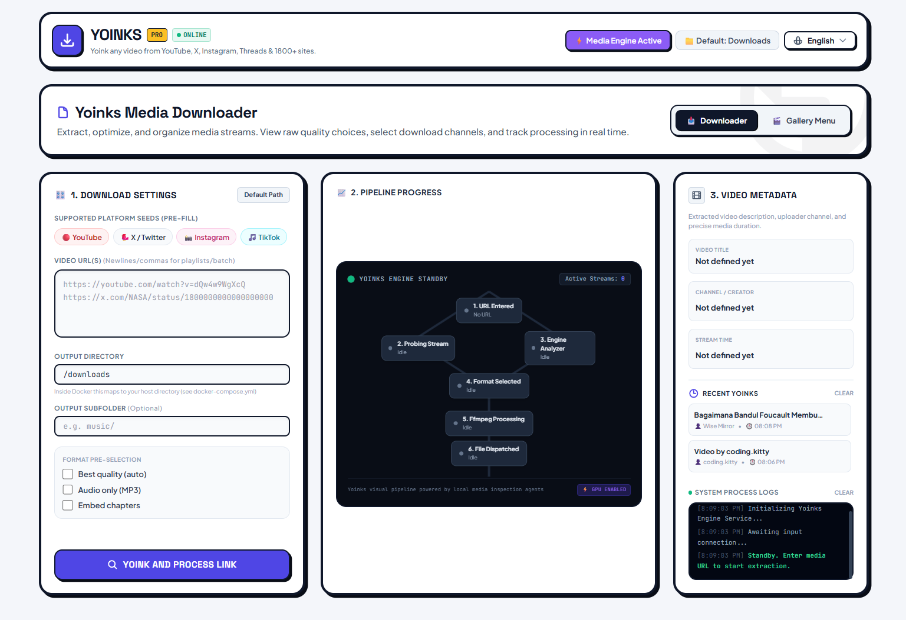
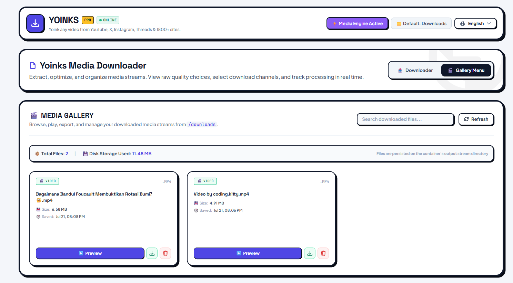

# yoinks

<picture>
  <source media="(prefers-color-scheme: dark)" srcset="assets/logo-dark.svg">
  
</picture>

**yoink any video. paste. yoink. done.**

Download videos from YouTube, X/Twitter, Instagram, Threads, TikTok and 1,800+ other sites — right from your terminal, WebUI workspace, or Telegram bot. Paste a URL, pick a resolution (or audio-only format), done. No popups, no fake download buttons, no sketchy redirects.

### 🌐 WebUI Media Workspace & Downloader


### 🎬 Integrated Media Gallery


---

## 🌟 Key Features

- ⚡ **Terminal CLI**: Interactive Ink TTY interface or non-interactive scriptable mode (`--best`, `--mp3`, `-o <dir>`).
- 🌐 **WebUI Media Workspace**: Neo-brutalist Bento Grid web interface with real-time pipeline status, batch URL support, and preset seeds.
- 🎬 **Media Gallery**: Integrated player modal with HTTP 206 range-request streaming for video & audio playback, file export, and disk management.
- 🔒 **Visual Authentication**: Protected workspace with visual login screen, session cookie auth (`AUTH_PASSWORD` / `BASIC_AUTH`), and header logout button.
- 🤖 **Telegram Bot**: Long-polling bot with live progress bar (`[████████░░] 80%`), quality selector keyboard, and audio format selection (MP3, M4A, Opus).
- 📁 **Download History**: Automatic persistent download history logged to `~/.yoinks/history.json`.
- 🐳 **Docker Self-Hosting**: Out-of-the-box containerization support.

---

## 📦 Installation & Quick Start

### 1. Run from Source (WebUI Server)

```sh
# Clone repository
git clone https://github.com/latif/yoinks.git
cd yoinks

# Install dependencies and build
npm install
npm run build

# Start WebUI server (default: http://localhost:3000)
npm start
```

### 2. Run CLI Tool

```sh
# Interactive CLI
npx tsx src/cli.tsx <url>

# Scriptable / Non-interactive CLI
npx tsx src/cli.tsx --best https://youtu.be/dQw4w9WgXcQ
npx tsx src/cli.tsx --mp3 -o /downloads https://youtu.be/dQw4w9WgXcQ
```

### 3. Run via Docker Compose

```sh
# Copy environment configuration
cp .env.example .env

# Start container in background
docker-compose up -d
```

### 4. Shell Installer (Linux / macOS)

```sh
./install.sh
```

---

## ⚙️ Environment Variables

| Variable | Description | Default |
| :--- | :--- | :--- |
| `PORT` | WebUI server listening port | `3000` |
| `HOST` | Bind address (`0.0.0.0` for LAN access) | `0.0.0.0` |
| `OUT_DIR` | Directory to save downloaded files | `~/Downloads` or `/downloads` |
| `AUTH_PASSWORD` | Optional workspace password/PIN for WebUI auth | _None (Public)_ |
| `BASIC_AUTH` | Optional `user:password` for HTTP Basic Auth | _None_ |
| `TELEGRAM_BOT_TOKEN` | BotFather token to enable Telegram bot | _None (Disabled)_ |
| `TELEGRAM_ALLOWED_USERS` | Comma-separated list of allowed Telegram user IDs | _All users allowed_ |

---

## 🚀 Enhancements over Original Repository (Changelog)

Compared to the upstream repository, this enhanced edition includes major architectural, UI/UX, security, and feature additions:

| Feature / Area | Original Repository | Enhanced Fork Edition |
| :--- | :--- | :--- |
| **Web Interface** | Basic / Minimal Web UI | 🌐 **Single-Page WebUI Workspace** with Neo-Brutalist Bento Grid, preset seeds, batch link parsing, & live terminal process logs |
| **Media Gallery** | ❌ None | 🎬 **Integrated Media Gallery** with video/audio player modal, HTTP 206 range-request streaming, export, & deletion |
| **Authentication** | ❌ None | 🔒 **Visual Login Page** with session cookie auth (`AUTH_PASSWORD` / `BASIC_AUTH`), protected APIs, & header Logout button |
| **Telegram Bot** | ❌ None / Minimal | 🤖 **Telegram Bot Integration** with live progress bar (`[████████░░]`), resolution picker, and audio format selector (MP3, M4A, Opus) |
| **Architecture** | Monolithic `index.ts` (>1900 lines) | 🏗️ **Refactored Modular Architecture** (`ui.ts`, `jobs.ts`, `gallery.ts`, `index.ts` — each <800 lines) |
| **Process Management** | Single global child process | ⚡ **Multi-child Process Tracking** (Set-based child process tracking; safe concurrent downloads) |
| **Security & DOS** | Vulnerable to flag injection & payload DOS | 🛡️ **Flag Injection Protection** (`--` before URLs), payload byte caps (1 MB), & safe path traversal checks |
| **Memory Optimization** | Loaded entire files into RAM buffer | 💾 **Streaming Uploads** via `fs.openAsBlob()` (zero RAM spikes during 50MB+ Telegram uploads) |
| **History Tracking** | ❌ None | 📁 **Persistent Download History** logged to `~/.yoinks/history.json` |
| **Temp File Management** | Temp metadata left in `/tmp` | 🧹 **Auto-Cleanup** of temporary JSON metadata files |

---

## 📋 Status & Roadmap

- [x] `--best` / `--mp3` flags to skip format picker (scriptable mode)
- [x] `-o <dir>` output folder selector
- [x] Playlist / thread-with-multiple-videos & batch URL support
- [x] Clipboard detection: launch bare and auto-suggest copied URL
- [x] Self-update for yt-dlp binary (`yoinks --update`)
- [x] Single-Page WebUI Media Workspace with Bento Grid & Media Gallery
- [x] Visual Login Screen, Session Cookie Auth (`AUTH_PASSWORD`), & Logout Button
- [x] Telegram Bot integration with live progress bar (`[████████░░]`) & audio format selector (MP3, M4A, Opus)
- [x] Docker & docker-compose container support
- [x] Persistent download history logging (`~/.yoinks/history.json`)

---

## ⚖️ Fair Use & Disclaimer

yoinks is a personal-archiving tool. Downloading content may violate a platform's terms of service — only download what you have the right to keep, and be excellent to creators.

## 📄 License

[MIT](LICENSE)
